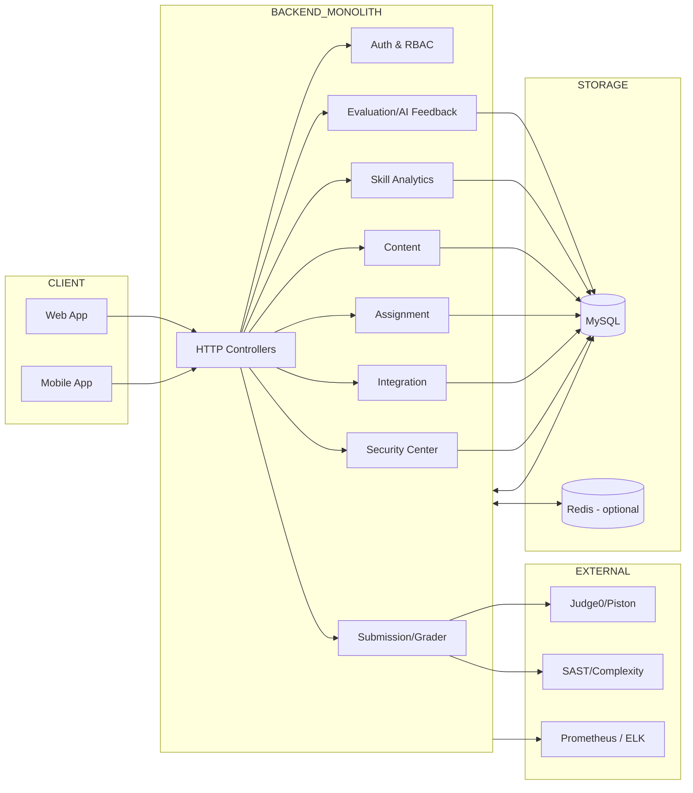
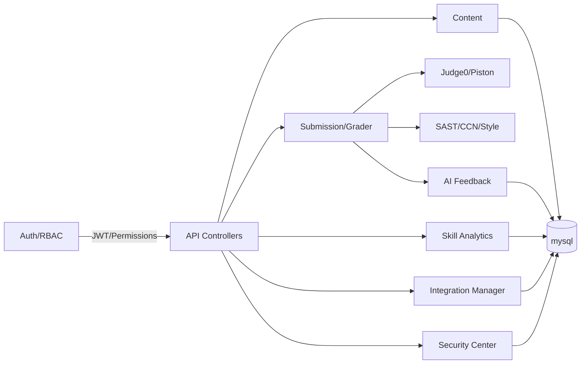
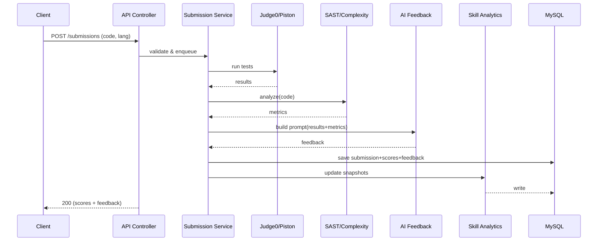

# APSAS - Automated Programming Skills Assessment System

Hệ thống tự động chấm code, đánh giá kỹ năng và đưa ra phản hồi cá nhân hóa, giúp nâng cao trải nghiệm học tập cho sinh viên và giảm tải công việc cho giảng viên.

## 🚀 Quick Start

### 1. Start Docker Services

```bash
cd environment
docker compose up -d
```

### 2. Run Application

**Cách 1: Normal Start (Quick)**

```powershell
.\run-local.ps1
```

**Cách 2: Start với Cleanup** (nếu gặp lỗi)

```powershell
.\run-local.ps1 -Cleanup
```

**Cách 3: Force Cleanup** (không hỏi)

```powershell
.\run-local.ps1 -Cleanup -Force
```

📖 **Chi tiết:** Xem [STARTUP_GUIDE.md](STARTUP_GUIDE.md)

## Demo Seed Data (External File)

Seeder supports external demo user data (no hardcoded list in Java):

- Source file: `src/main/resources/seed/demo-users.json`
- Override source path by env var: `DEMO_USERS_SOURCE`
- Enable/disable demo seed by env var: `APP_SEED_DEMO_USERS_ENABLED` (default `true`)

Example JSON item:

```json
{
  "email": "student.demo@apsas.local",
  "name": "Demo Student",
  "roleName": "STUDENT",
  "avatarUrl": "https://i.pravatar.cc/300?img=12"
}
```

---

> Spring Boot 3, Java 17+, mysql, WebClient, JWT, Flyway, Micrometer.

### 2.1 High-Level System Flow



### 2.2 Component Responsibility Map



### 2.3 Sequence – Grading Pipeline (rút gọn)



---

## 3) Module Structure (source tree)

```text
src/
 └─ main/
     ├─ java/com/project/apsas/
     │    ├─ configuration/    # Cấu hình hệ thống (Security, CORS, Swagger, Database...)
     │    ├─ controller/       # REST Controllers (API layer - Điểm tiếp nhận request)
     │    ├─ dto/              # Data Transfer Objects (Request/Response models)
     │    ├─ entity/           # JPA Entities (Ánh xạ bảng Database)
     │    ├─ enums/            # Các hằng số định danh (Status, Type, Roles...)
     │    ├─ exception/        # Xử lý lỗi tập trung (@ControllerAdvice, Custom Exceptions)
     │    ├─ integration/      # Xử lý tích hợp bên ngoài (Judge0, AI Service, Email...)
     │    ├─ mapper/           # Chuyển đổi dữ liệu giữa Entity và DTO (MapStruct)
     │    ├─ repository/       # Data Access Layer (Spring Data JPA)
     │    ├─ service/          # Business Logic (Xử lý nghiệp vụ chính)
     │    └─ ApsasApplication  # Class khởi chạy ứng dụng (Main class)
     └─ resources/
          └─ application.yaml  # File cấu hình chính của ứng dụng
```

---
