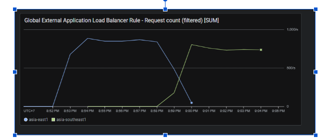

# Cloud Platform Automated Failover (CPAF)

[](https://www.terraform.io/)
[](https://cloud.google.com/)
[](https://spring.io/projects/spring-boot)

This project focuses on building a highly resilient cloud infrastructure capable of **Automated Failover** and **Zero-Downtime**. Deployed on Google Cloud Platform (GCP) using Infrastructure as Code (IaC), the system is designed to monitor the health of application instances in real-time and automatically switch traffic to redundant backup nodes in the event of a critical failure, while elastically scaling based on traffic demands.

## Architecture Documentation

- Cloud infrastructure architecture and Terraform mapping: [docs/CLOUD_INFRA_ARCHITECTURE.md](docs/CLOUD_INFRA_ARCHITECTURE.md)
- Cloud system architecture diagram (Mermaid): [docs/CLOUD_SYSTEM_DIAGRAM.md](docs/CLOUD_SYSTEM_DIAGRAM.md)

## 🏗 System Architecture

The infrastructure implements a **Multi-Region High Availability** topology on Cloud Run to eliminate single points of failure.


### Failover Evidence

The chart below shows request traffic shifting from one region to the other when a region is down. This is the operational proof that the load balancer continues serving users through the healthy region instead of stopping at the failed one.



**Core Architectural Components:**

- **Cloud Load Balancing:** Acts as the global entry point, performing health checks and intelligently routing user traffic away from degraded zones.
- **Cloud Run Primary/Failover Services:** Backend and frontend are deployed in 2 regions with serverless NEG integration.
- **Traffic Failover Control:** Load balancer can include/exclude failover backends based on Terraform configuration.
- **Cloud SQL + Replica:** MySQL primary with cross-region replica for failover operations.
- **Observability:** Cloud Monitoring uptime checks and alert policies for frontend/backend availability and error spikes.

## 🚀 Key Features

- **Real-time Health Monitoring:** Proactive detection of application-level failures, not just hardware status.
- **Automated Disaster Recovery:** The system rebuilds crashed nodes without manual operational intervention.
- **Infrastructure as Code (IaC):** 100% of the GCP infrastructure is provisioned and managed using Terraform modules.
- **Zero-Downtime Deployments:** Capable of rolling updates without dropping active user connections.

## 📁 Repository Structure

The infrastructure is built using a highly modular Terraform design pattern:

````text
.
├── APSAS_BE/                # Spring Boot Backend Application
├── APSAS_FE/                # Frontend Client
└── infrastructures/         # Terraform Infrastructure Setup
    ├── modules/
    │   ├── networking/          # VPC, subnet, router, NAT
    │   ├── cloud_run/           # FE/BE services + VPC connectors
    │   ├── global_load_balancer/# URL map + backend services + forwarding rule
    │   ├── database/            # Cloud SQL + Redis
    │   ├── kafka/               # Managed Kafka clusters
    │   ├── monitoring/          # Uptime checks + alerts + log metrics
    │   └── platform_services/   # Artifact Registry + required APIs
    └── environments/prod/       # Root wiring and production variables

## Vận hành hạ tầng thủ công (không dùng CI/CD)

Dự án hiện tập trung vào hạ tầng cloud, thao tác triển khai được thực hiện thủ công qua Terraform và `gcloud`.

### 1) Triển khai hạ tầng

```bash
cd infrastructures/environments/prod
terraform init
terraform plan
terraform apply -auto-approve -input=false
```

### 1.1) Cập nhật app mới (build FE+BE, push image, apply luôn)

```bash
cd infrastructures/environments/prod
./scripts/deploy-app-update.sh

# Hoặc tự đặt tag
./scripts/deploy-app-update.sh v2026-04-20
```

### 2) Kiểm tra endpoint sau triển khai

Use Terraform outputs from `infrastructures/environments/prod`:

```bash
terraform output -raw frontend_entrypoint
terraform output -raw backend_entrypoint
```

Then test:

```bash
curl -I "$(terraform output -raw frontend_entrypoint)"
curl -I "$(terraform output -raw backend_entrypoint)/healthz"
```

Quick easy domain (no custom DNS ownership needed):

```bash
terraform output -raw fixed_domain_nip_io
# Example: app.<global_lb_ip>.nip.io
```
````
