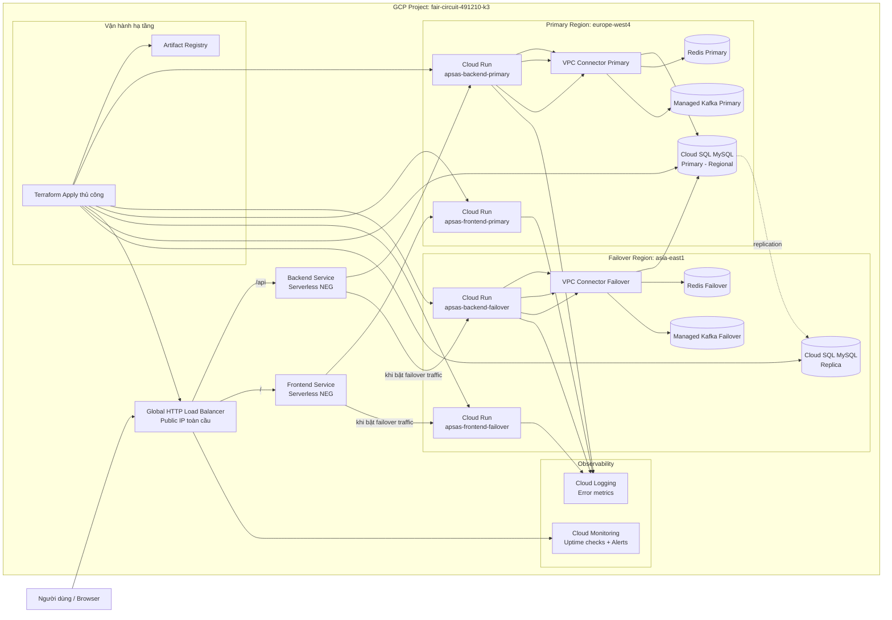

# Sơ đồ tổng thể hệ thống Cloud

Tài liệu này mô tả kiến trúc cloud toàn hệ thống APSAS trên GCP ở mức tổng quan, bám theo hạ tầng Terraform hiện tại.

## 1) Sơ đồ kiến trúc tổng thể

## 2) Diễn giải nhanh

- Luồng người dùng đi vào một Global Load Balancer duy nhất.
- LB tách traffic theo đường dẫn: `/api` vào backend, còn lại vào frontend.
- Mỗi lớp FE/BE có 2 dịch vụ Cloud Run (primary + failover).
- Backend primary và failover đều được cấu hình truy cập DB active qua biến `MYSQL` do Terraform quản lý.
- Cloud SQL có replica cross-region để sẵn sàng promote khi sự cố.
- Monitoring + Logging dùng để theo dõi uptime và cảnh báo lỗi.
- Hệ thống hiện tập trung vận hành hạ tầng thủ công qua Terraform và `gcloud`.

## 3) Mapping hạ tầng với Terraform

- Networking: `infrastructures/modules/networking/main.tf`
- Cloud Run: `infrastructures/modules/cloud_run/main.tf`
- Load Balancer: `infrastructures/modules/global_load_balancer/main.tf`
- Database + Redis: `infrastructures/modules/database/main.tf`
- Kafka: `infrastructures/modules/kafka/main.tf`
- Monitoring: `infrastructures/modules/monitoring/main.tf`
- Platform services: `infrastructures/modules/platform_services/main.tf`
- Root wiring production: `infrastructures/environments/prod/main.tf`

## 4) Ghi chú failover

- Failover traffic được điều khiển bằng biến `enable_failover_traffic`.
- Failover DB hiện vận hành thủ công bằng lệnh `gcloud` (promote replica + cập nhật `MYSQL` cho Cloud Run).
- Sau khi promote DB replica, cần cập nhật `active_db_private_ip_override` trong `terraform.tfvars` để tránh drift IaC.
